# MTF 声音女性化练习手册

By Aoi

2021 年 7 月 第一版

# 目录

写在前面.

背景知识.

声音的性别感知 9

使用 praat 辅助声音练习 13

针对不同声音要素的具体练习 16

# 写在前面

一定程度的声音女性化是 MTF以认同性别融入社会生活的重要条件，具有女性性别特征的声音通常更容易使 MTF被识别为女性，有利于实现自我认同与社会评价的一致性，改善社交水平，提高社会生活的质量。MTF社群中已经有很多声音女性化的训练手册或视频等资料，但质量参差不齐，尤其是中文 MTF社群更是缺乏高质量的资料，很多 MTF选择参考“伪声”等侧重娱乐性的教学视频作为练习的指导，而往往因为这类视频中模糊的表述和单一的训练方式，始终不得其门而入。

事实上，声音女性化是完全可以用科学、准确的语言进行解释的。依赖于语音声学（Voice Acoustic）的知识，我们能够确定哪些声音特征具有性别区分的能力，以及这些声音特征与何种可以进行科学分析的音频数值有关，进而这些音频数值又与哪些生理的、解剖学上的人体结构有关。另一方面，依赖于声乐训练（Vocal Training）的既有技术，我们有很多方法可以练习控制和改变与发声有关的人体结构，达到声音女性化的目的。记住我们的两大基石：语音声学和声乐技术。

了解了上面的知识，我们不难意识到：声音女性化的训练并不是靠天赋或者悟性之类玄而又玄的能力，它和其他所有知识学习一样，靠的是搭建语音声学的知识框架、使用声乐训练的方法勤加练习、再将练习的成果和知识相结合进行反思和分析。请千万不要忽略掉知识框架的搭建而直接进入练习，没有知识框架为你提供分析的工具和反思的参照，你的练习极有可能沦为盲目的挣扎，切记，切记。

另外还有一个方面需要注意：声音女性化是一种需要学习的知识，但学习绝不等同于学生时代那种沉重的、应试的课业，如果你在声音女性化的练习过程中找不到快乐的感觉，那一定是你对它的认知出现了偏差。想象一下你小时候咿呀学语的体验，或者你和同伴玩耍时模仿出的各种声音（学机器人说话、学动画角色说话、过家家扮演老太太——你一定经历过这些），你在练习声音女性化时需要找到的正是这种有趣的探索式的体验。

放轻松，记住，你的声音是你的孩提时光留给你的宝库，你要足够贪玩才能找到开启宝箱的方法，别怕出糗，别端着成熟的架子，像个孩子一样玩你的声音，你玩得越尽兴，得到的就越多。

# 背景知识

# 一、人声的生理解剖学知识

# 1、声道（vocal tract）的结构：

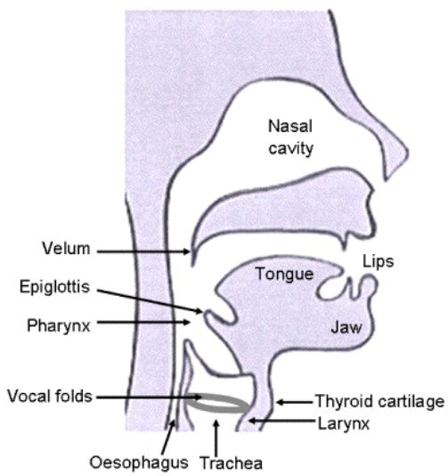

text_image

Nasal cavity
Velum
Epiglottis
Pharynx
Vocal folds
Oesophagus Trachea
Tongue
Lips
Jaw
Thyroid cartilage
Larynx

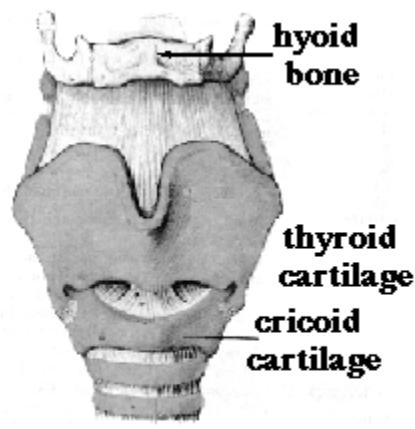

text_image

hyoid
bone
thyroid
cartilage
cricoid
cartilage

声带（vocal folds）：声带是两片白色的人体组织，由韧带和牵引韧带的肌肉、包裹韧带的黏膜组成。人在呼吸时声带打开，发声时声带闭合，气流从肺部出发，经气管向上流向声带，冲击处在闭合状态的声带，引起声带振动，从而发出有振荡波形特征的声音。

咽部（pharynx）：广义上是声门上方腔体结构的统称（包括鼻腔、口腔和喉咽部），狭义指下咽部即喉咽部，是会厌下方到声带上方的腔体，也是空气在声带形成振动后流经的第一个腔体。

会厌（epiglottis）：声带上方的一块软骨，在呼吸和发声时，会厌翻起，使喉腔敞开，气流得以流出，在饮水和进食时，会厌翻下，遮住声带和气管，避免水和食物进入气管。会厌的翻起程度可以在一定程度上影响声音的音色。

喉部（larynx）：声门下方的腔体。

软腭（velum 或 soft palate）：口腔上壁的后 1/3，也是口腔和鼻腔之间的开口部，主要由肌、肌腱和黏膜构成，可以活动，放松状态下可以使口腔与鼻腔联通，闭合时可以起到关闭鼻腔的作用。

舌头（tongue）：分为舌尖、舌体和舌根，舌根通过会厌沟连接至会厌，舌尖和舌根都可以相对独立地活动，舌头在口腔内的前后、高低位置均能够改变声音的音色。

舌骨（hyoid bone）：是喉部上方的一个 U 形骨骼。舌骨从上方支撑喉部，其本身通过肌肉和肌腱附着在下颌骨上。舌骨和其附属肌肉的活动对于在吞咽和说话过程中提升喉部很重要。

甲状软骨或俗称喉结（thyroid cartilage）：是喉部前壁的主要部分，位于甲状腺上方，可以保护位于它后方的声带。当甲状软骨和环状软骨的相对角度发生变化时，音

高会随之变化。

环状软骨（cricoid cartilage）：喉部的下部由称为环状软骨的圆形软骨组成。这个软骨的形状像一个环，环的大部分在后面。环状软骨下方是气管环。

# 2、一些肌肉

喉部的运动由两组肌肉控制，在喉部内负责移动声带和其他肌肉的肌肉称为喉内肌肉，喉部在颈部上的位置则由称为喉外肌群的另一组肌肉控制。

喉外肌群：

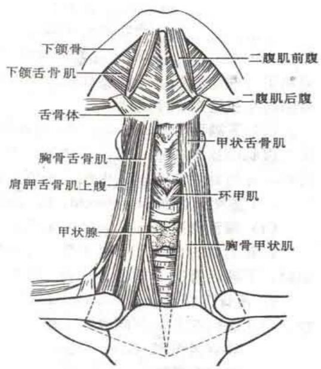

text_image

下颌骨
下颌舌骨肌
舌骨体
胸骨舌骨肌
肩胛舌骨肌上腹
甲状腺
二腹肌前腹
二腹肌后腹
甲状舌骨肌
环甲肌
胸骨甲状肌

喉外肌群，又称舌骨的上下肌群，从舌骨体的位置区分，在舌骨体上方的几个肌肉称为舌骨上肌群（或在一些声乐教程中称为吞咽肌肉），在下方的称为舌骨下肌群。一般来说，舌骨上肌群可以抬高喉部，而舌骨下肌群可以拉低喉部。声音女性化需要着重练习使用舌骨上肌群中的下颌骨舌肌，另外也需要学会控制其他肌肉的放松。

喉内肌肉：

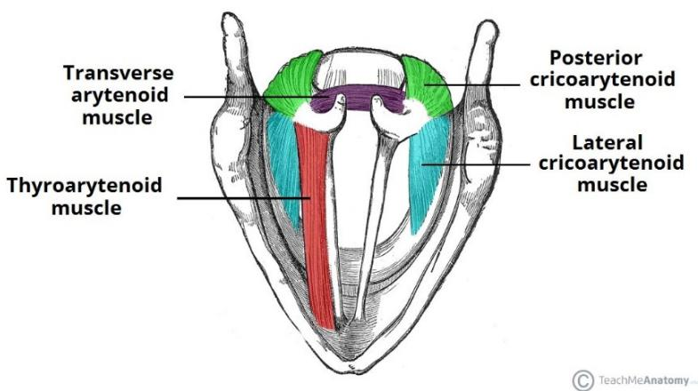

text_image

Transverse arytenoid muscle
Thyroarytenoid muscle
Posterior cricoarytenoid muscle
Lateral cricoarytenoid muscle
© TeachMeAnatomy

喉内肌作用于喉的各个组成部分。它们控制声门的形状（声带和杓状软骨之间的开口），以及声带的长度和张力。

甲杓肌（thyroarytenoid muscle）：又称为声带肌，是声带的肌肉层，负责放松声带韧带、缩短声带。

环杓侧肌（lateral cricoarytenoid muscle）：从环状软骨前部延伸到杓状软骨的肌肉，负责内收声带

环杓后肌（posterior cricoarytenoid muscle）：又称为环杓副肌，一对从环状软骨后部延伸到杓状软骨的肌肉，负责打开声带。

杓间横肌（transverse arytenoids muscle）：负责连接两侧杓状软骨。

# 复习问题：

1、声音从肺部产生后经过哪些位置？  
2、喉结和声带分别在什么位置？  
3、舌骨的上下肌群以什么区分？

# 尝试：

1、咽一下口水，摸一摸下颌骨舌肌的位置，感觉到它绷紧了吗？  
2、环住脖子，用力作出愤怒的表情，感觉到舌骨下肌群的运动了吗？

# 二、语音声学（Voice Acoustic）的概述

# 1、源-滤波器理论（Source-Filter Theory）

源-滤波器模型是一种关于语音（人声）产生的理论，它认为从发生者口中向外发出的、具有复杂波形的声音，取决于两个部分：

1、源（Source）——声门的波形  
2、滤波器（Filter）——声道（vocal tract）对源的波形施加的放大和减弱作用

或者简单地说：源产生初始声音，声道滤波器对其进行修改。

对源的进一步解释：

发出浊音时，声带会振动，空气以不同的宽度通过，从而产生声波。你可以试试将手指放在靠近喉部的位置上（比如喉结上），然后大声唱歌或说话，你会感觉到振动的存在。

浊音中产生的振动通常包含一组不同的频率（frequency），称为谐波，不同的频率有着不同的音量（amplitude），通常我们以横坐标表示频率高低，纵坐标表示特定频率对应的音量高低，以此绘制一个声音的频谱图。

对滤波器的进一步解释：

源产生的声音波形由滤波器改变，舌头的位置和嘴巴张开的形状会造成不同的频率改变，因此发出的声音会有所不同。你可以尝试以恒定的音高和音量唱出一个持续的音符（比如大声发出啊的声音），在持续发音的过程中改变你嘴巴的开闭程度和舌头的上下前后位置，你会发现你发出了其他元音或音素的声音。比如张嘴发出“啊”声，然后慢慢把唇形变小变圆，你会发现你的声音变成了“欧”。

软腭的位置也会造成滤波器的改变。你可以尝试分别发出“嗯”和“啊”这两个声音，然后尝试用手指捏住鼻子张开嘴，然后松开鼻子捏住嘴，你会发现软腭有连通口腔和鼻腔的作用，也会意识到鼻腔的状态也可以影响和改变声音。

虽然源滤波器理论是对语音（人声）的一个很好的近似解释，但我们必须记住这个理论只是一个近似。语音产生的实际过程是非线性和时变的，源和滤波器之间也不是纯粹的单向关系，而是存在复杂的交互作用。当需要从严格意义上讨论语音问题时，这一理论往往是不充足的。然而，这个理论在大部分情况都能给出合理的近似，因此，许多语音技术都基于这个理论。

在进一步学习前，我们还需要强化理解两个语音声学中描述声音特性的常用概念：1、音量（amplitude），声波的振动幅度，也代表着被听到的声音的大小；2、频率（frequency），声波的振动速度，频率越高，振动越快，声音听起来越尖锐，频率越低，振动越慢，声音听起来越低沉，人耳能听到的声音频率范围在 20-20000Hz之间。回忆一下中学的物理课，你应该能记起这些概念。

有了上面这些知识，现在我们就可以来实践一下源-滤波器理论：

声道处在某个自然状态时，给声道滤波器施加频率由高到低连续的源声波，滤波器的响应（即声道发出的声音）频谱图如下：

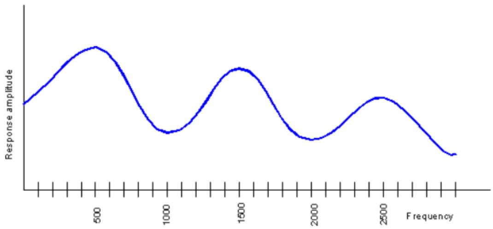

line

| Frequency | Response amplitude |
| --------- | ------------------ |
| 0         | ~0.8               |
| 500       | ~1.0               |
| 1000      | ~0.6               |
| 1500      | ~0.9               |
| 2000      | ~0.7               |
| 2500      | ~0.8               |
| >2500     | ~0.6               |

记得我们上面说的谐波吗？真实的声带发出的源声波（谐波）是这样的（不是连续的，而是若干组特定的频率）：

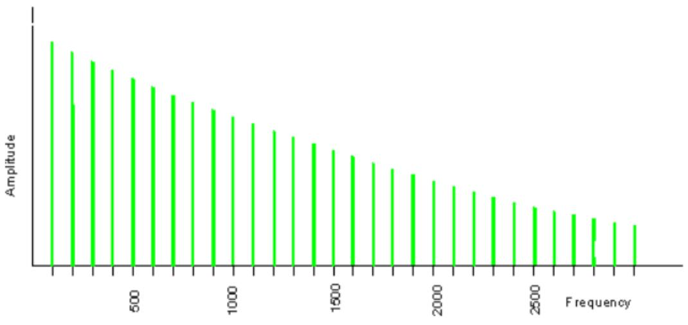

bar

| Frequency | Amplitude |
|---|---|
| 100 | 100 |
| 200 | 95 |
| 300 | 90 |
| 400 | 85 |
| 500 | 80 |
| 600 | 75 |
| 700 | 70 |
| 800 | 65 |
| 900 | 60 |
| 1000 | 55 |
| 1100 | 50 |
| 1200 | 45 |
| 1300 | 40 |
| 1400 | 35 |
| 1500 | 30 |
| 1600 | 25 |
| 1700 | 20 |
| 1800 | 15 |
| 1900 | 10 |
| 2000 | 5 |
| 2100 | 3 |
| 2200 | 2 |
| 2300 | 1 |
| 2400 | 1 |
| 2500 | 1 |
| 2600 | 1 |
| 2700 | 1 |
| 2800 | 1 |

还记得我们的源-滤波器理论吗？没错，将上面两幅图（滤波器的响应和源声波）结合起来，我们就得到了一个真实的人声频谱图：

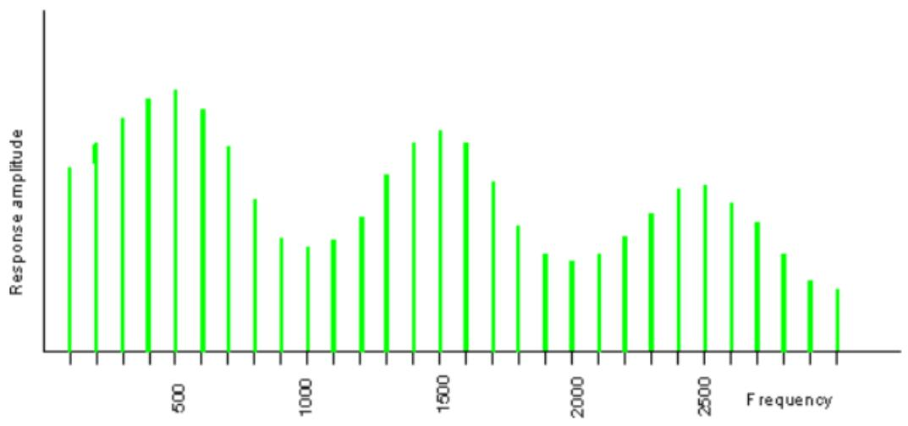

bar

| Frequency | Response amplitude |
| --------- | ------------------ |
| 0         | 0.8                |
| 100       | 0.9                |
| 200       | 1.0                |
| 300       | 1.1                |
| 400       | 1.2                |
| 500       | 1.3                |
| 600       | 1.4                |
| 700       | 1.5                |
| 800       | 1.6                |
| 900       | 1.7                |
| 1000      | 1.8                |
| 1100      | 1.9                |
| 1200      | 2.0                |
| 1300      | 2.1                |
| 1400      | 2.2                |
| 1500      | 2.3                |
| 1600      | 2.4                |
| 1700      | 2.5                |
| 1800      | 2.6                |
| 1900      | 2.7                |
| 2000      | 2.8                |
| 2100      | 2.9                |
| 2200      | 3.0                |
| 2300      | 3.1                |
| 2400      | 3.2                |
| 2500      | 3.3                |
| 2600      | 3.4                |
| 2700      | 3.5                |
| 2800      | 3.6                |
| 2900      | 3.7                |
| 3000      | 3.8                |
| 3100      | 3.9                |
| 3200      | 4.0                |
| 3300      | 4.1                |
| 3400      | 4.2                |
| 3500      | 4.3                |
| 3600      | 4.4                |
| 3700      | 4.5                |
| 3800      | 4.6                |
| 3900      | 4.7                |
| 4000      | 4.8                |
| 4100      | 4.9                |
| 4200      | 5.0                |
| 4300      | 5.1                |
| 4400      | 5.2                |
| 4500      | 5.3                |
| 4600      | 5.4                |
| 4700      | 5.5                |
| 4800      | 5.6                |
| 4900      | 5.7                |
| 5000      | 5.8                |

当你用相同的音高说不同的元音时，谐波将保持相同的距离（即频率的数量不变，也就意味着竖条的间距不变），但最高点会在不同的频率上（不同的左右位置）。

当你用不同的音高说同一个元音时，最高点的频率（左右位置）和频谱的整体形状保持不变，但谐波的间隔会不同（即频率的数量增减，也就是竖条变多或变少）。

看，你现在可以读懂这些频谱图了。你一定想知道这些最高点的左右位置和频谱的形状到底意味着什么，这就是我们下面要讲到的共振和共振峰。

# 2、共振与共振峰

共振：

每个物体都有它们固有的振动频率。如果你试图以不同的频率振动它，振动将被抑制并最终消失。如果你以它固有的频率振动它，振动将得到加强，并产生共振（Resonance）。

共振的一些例子：

拿着跳绳一端周期性上下抖动时在绳上产生的驻波

对着一个半满的啤酒瓶瓶口吹气，你会听到一个恒定的音符

小提琴响板上的振动

当你恰到好处地推动秋千时，秋千会荡得更高

如果你试图让一个物体以固有共振频率的两倍去振动，效果不会很好。如果你试图让它以固有共振频率的三倍去振动，它将再次产生共振——尽管没有较低的共振频率振动得那么强。这种情况会重复出现——最低共振频率的每一个奇数倍都是一个有效的共振频率。

固有频率的倍数 有共振吗？

<table><tr><td>1倍</td><td>有</td></tr><tr><td>2倍</td><td>没有</td></tr><tr><td>3倍</td><td>有</td></tr><tr><td>4倍</td><td>没有</td></tr><tr><td>5倍</td><td>有</td></tr></table>

对于一个 17厘米长的半开管状乐器（这是成年男性声道的典型长度），它的共振频率是 500赫兹、1500赫兹、2500赫兹、3500赫兹，以此类推。

还记得上一节最后的频谱图吗？不妨回看一下，你会发现频谱图上的几个最高点恰好处在 500Hz、1500Hz、2500Hz 的位置，所以你会发现，人声和管状乐器发出的声音类似，也同样是一种共振的声波。

在语音声学中，我们将人声发声过程中在声道中出现的每次共振按照产生共振频率的高低，排列为 R1、R2、R3……Ri。记住这个概念，我们下面还会用到。

共振峰：

我们刚刚提到了频谱图的最高点，这些最高点就被称为共振峰（formant），共振峰在语音声学上的严谨定义比较难懂，如果愿意了解，可以看下面的内容：

James Jeans (1938)用共振峰来表示通过共振增强的音符谐波的集合。

Gunnar Fant (1960)给出的定义：“声谱的谱峰 | P ( f )| 被称为共振峰”。

Benade (1976)给出的定义：“在频谱包络中观察到的峰值称为共振峰”。

在其声学术语标准中，美国声学学会(1994)将共振峰定义为：“对于复杂声音，声谱中存在绝对或相对最大值的频率范围。单位，赫兹 (Hz)。注意——最大频率是共振峰频率。”

简单地理解，共振峰就是频率响应曲线中的每个凸起，也就是声音的所有频率中若干个音量最大的共振频率。它们通常被称为 F1、F2、F3 等。 还记得我们上面的频谱图吗？它的共振峰分别是：

F1 第一共振峰 500 赫兹

F2 第二共振峰 1500赫兹  
F3 第三共振峰 2500 赫兹

通过上面的分析你会发现，一个人声是具有多个共振峰的。我们将这些共振峰的频率由低到高称为 F1、F2、F3、……Fi。还记得我们上面刚刚说过的的 R1、R2、R3……Ri 吗？没错，这两者是一一对应的关系，一次共振（Ri），就对应一个共振峰频率（Fi），大部分情况下，我们用 F1——Fi表达具体的某个共振峰频率，而较少使用R1——Ri，但很多文献和资料中也会将两者混合使用，我们只需要知道这两者的含义是大致相同的即可。

在前面那类频谱图（横坐标是频率，纵坐标是音量）中识别共振峰是容易的（波形的极大值点），但下面我们要介绍另一种更加复杂但也更常用的频谱图，它的横坐标是时间，纵坐标是频率，而音量采用颜色深浅来表示，颜色深表示音量大，颜色浅表示音量小。

或者更直白地说，就是将前面那类频谱图压扁成一条线，原先的高点涂黑，原先的低点涂白，然后旋转变成一条竖线，这条竖线就是一个时间点上特定的频谱，将所有竖线从左至右排列，就得到了时变的频谱图。这类频谱图称为时变频谱图（时频图），如下图所示：

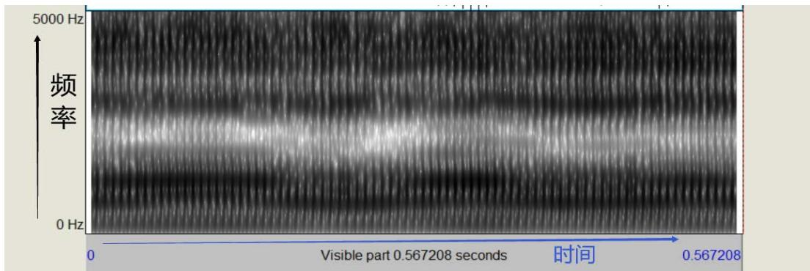

text_image

5000 Hz
频率
0 Hz
0 Visible part 0.567208 seconds 时间 0.567208

我们把颜色最深的点（也就是非时变频谱图上的最高点）标出，就得到了共振峰曲线（下图的红点），由下（低频）至上（高频）依次是 F1、F2、F3、F4、F5：

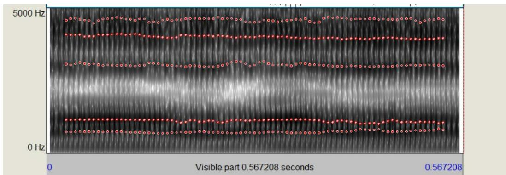

line

| Time (seconds) | Frequency (Hz) |
| -------------- | -------------- |
| 0              | 0              |
| 0.567208       | 5000           |

另外一个值得关注的问题是，你会发现时频图呈现出一道一道的竖条，而当你用更高的声音发音时，这些竖条的间隔变得更窄了（如下图）。

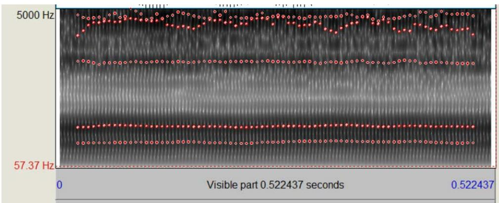

line

| Time (seconds) | Frequency (Hz) |
| -------------- | -------------- |
| 0              | 57.37          |
| 0.522437       | 5000           |

声音高时，波形更密集，声音低时，波形更稀疏，这种总体的声音频率高低，我们称为基准频率或基频（Base Frequency），写作 F0。但 F0 本身并不是一个单独的共振峰频率，这种写法只是为了方便记述。正如上面两图所示，虽然 F0从 140Hz 提高到了240Hz，但时频图的明暗分布、共振峰曲线的位置（也就是共振峰频率值）和数量，都并没有发生明显的变化，也就是说，F0的高低并不影响一个声音本身的共振峰特性。

另外，大部分声乐理论中有音高（Pitch）的概念，它和语音声学理论中的 F0基频是等价的，我们在后面可能同时使用这两种概念，请牢记它们的关系。

不管从非时变频谱图中，还是从时变的频谱图中，我们都可以按照一定规律找到声音的基频和共振峰。请记住，共振峰 Fi 是我们分析声音特征的核心工具。我们随后就要初步探究它。但现在，让我们回顾一下这一节的知识：

# 复习问题：

1、声音的源是什么？滤波器对应的是什么结构？  
2、当横坐标是频率，纵坐标是音量时，如何找到一个声音的共振峰？  
3、当横坐标是时间，纵坐标是频率时，如何找到一个声音的共振峰？  
4、基频和音高的关系是什么？

# 尝试：

1、微张开嘴，尝试发出一点声音，让声带振动起来  
2、保持持续发音，捏捏你的鼻子，随意动动你的舌头，听到你的声音在变化吗？你发现滤波器的工作方式了吗？

# 声音的性别感知

# 一、元音的共振峰特征

当我们发出一个单元音时（在汉语普通话里，通常是 a、o、e、i、u），我们的人声会产生多个共振峰。

元音的 F1 通常在 200 Hz到 800 Hz 之间，嘴型越小，F1越小，相反地，嘴巴张开会使 F1大幅增加。

下图分别是元音 a（左）与元音 u（右）的时频图，我们可以看到，a 音的 F1在700Hz 左右，而 u 音的 F1 在 340Hz 左右。

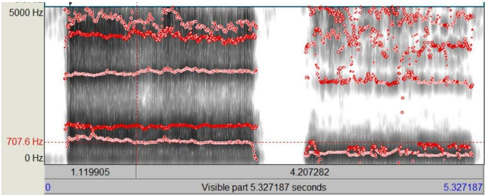

line

| Time (s) | Frequency (Hz) |
| -------- | -------------- |
| 1.119905 | 707.6          |
| 4.207282 | 5000           |

元音的 F2 典型值约为 800 至 2000 Hz。通过使嘴唇变圆或展开、升高或降低喉部，可以较大程度地改变 F2。

另外，根据发音时舌位的高低和前后，元音可以分为高元音、低元音、前元音和后元音。其中，F1的频率受舌位高度的影响：高 F1 = 低元音 = 低舌位，低 F1 =高元音 = 高舌位。F2的频率则更多受舌位前后影响：高 F2 = 前元音 = 前舌位，低F2 = 后元音 = 后舌位。对应于国际音标的元音分类如下图所示，左上至右下为前-高元音至后-低元音。

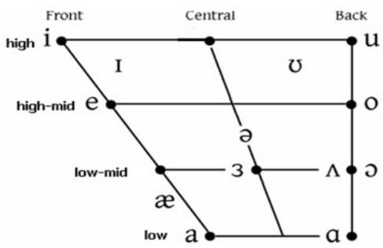

flowchart

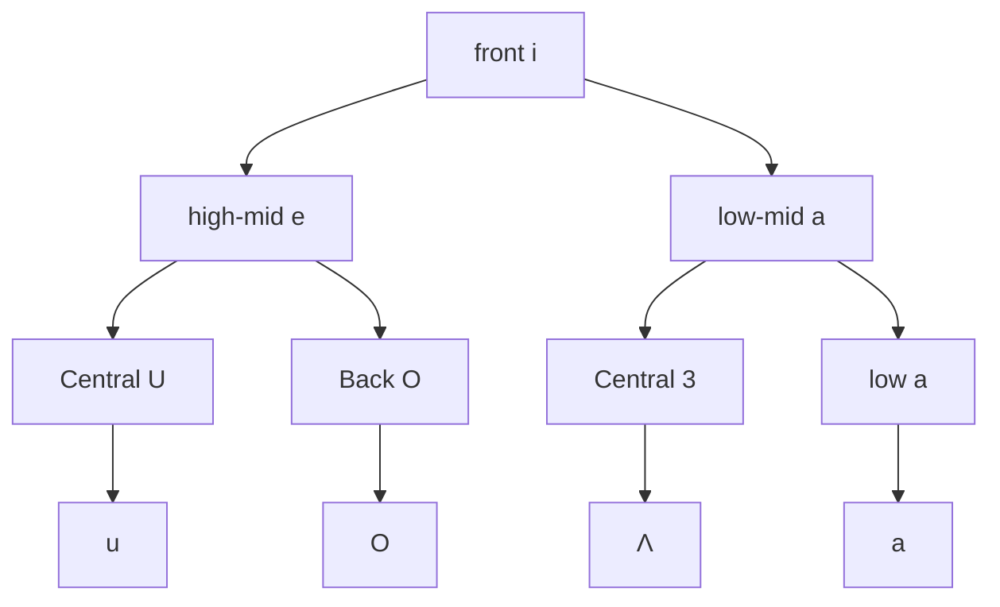

以实际的声音为例，下图分别是张嘴程度和嘴唇形状固定时分别以前舌位（左）和后舌位（右）发出 a音的时频图，可以看到，前舌位发 a 音的 F2在1200Hz 左右，后舌位发 a音的 F2在 1000Hz 左右。

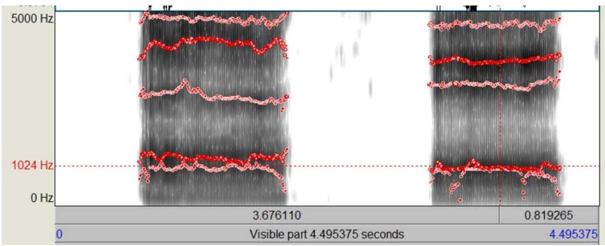

line

| Time (s) | Value     |
|----------|-----------|
| 3.676110 | 1024 Hz   |
| 0.819265 | 1024 Hz   |

F1 与 F2都受口腔大小、口型、舌位、喉位的影响，但总的来说，F1受嘴巴张开的影响最大，F2 则受舌根紧缩位置（即喉位）的影响最大。F3则与卷舌程度、圆唇和鼻音有关。

一些研究分析了男性和女性的元音空间，即不同元音的 F1与 F2，如图所示。（该研究旨在分析未经训练的成年人模仿声音性别特征的能力，左图为男性的元音空间，右图为女性的元音空间，蓝色表示两者模仿男性化特征时的声音，红色表示两者模仿女性化特征时的声音，绿色表示两者自然状态下的声音。横坐标为元音的 F2频率值，纵坐标为元音的F1 频率值，各点即为不同元音的具体位置。

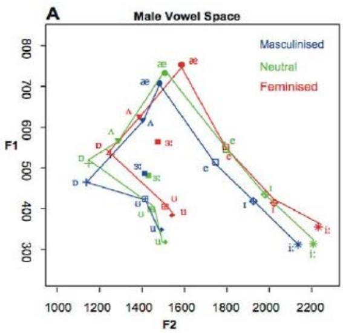

line

| Group       | F2    | F1    |
|-------------|-------|-------|
| Masculinised| 1200  | 450   |
| Masculinised| 1400  | 600   |
| Masculinised| 1600  | 750   |
| Masculinised| 1800  | 550   |
| Masculinised| 2000  | 400   |
| Masculinised| 2200  | 300   |
| Neutral     | 1200  | 500   |
| Neutral     | 1400  | 650   |
| Neutral     | 1600  | 750   |
| Neutral     | 1800  | 550   |
| Neutral     | 2000  | 450   |
| Neutral     | 2200  | 350   |
| Feminised   | 1200  | 550   |
| Feminised   | 1400  | 650   |
| Feminised   | 1600  | 750   |
| Feminised   | 1800  | 550   |
| Feminised   | 2000  | 450   |
| Feminised   | 2200  | 350   |

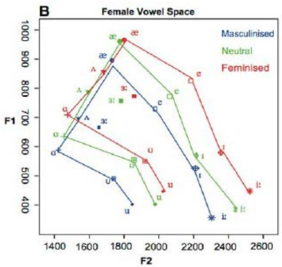

可以看到，女性发音者的 F1、F2相比男性发音者均有一定程度提升。

另外我们也能注意到一个对声音女性化而言十分重要的问题，即一个男性讲话者单纯等比例地提高所有声音的频率值（左图中的红色曲线），并不能产生与女性声音的共振峰特性相同的声音（右图中的绿色曲线）。 这就引出了我们接下来要讲到的一个重要问题，究竟哪些声音属性——尤其是共振峰特征——真正决定了声音的性别感知呢？

# 二、性别感知的关联因素

我们首先要谈到我们前面介绍过的一个概念，基频 F0，或者在声乐理论中被称为音高。有研究表明，在听众不知晓说话者性别的条件下，对其性别的识别是基于基频，即 F0 的，即使在共振峰频率特征与基频特征相反时仍然如此。[1]

一般认为，男性说话声音的 F0 范围在 85-155Hz 之间，而女性说话声音的 F0范围在 165-255Hz 之间，看，非常巨大的差别。我们可以肯定地说，高的 F0 是声音被感知为女性的先决条件，也是声音女性化的基石。

除了 F0 的重要作用，很多研究还得出了一个相对一致的结论，F2是各 Fi 共振峰中最能够区分性别特征的一个[2]，部分可能的原因在于，F2 受喉位高低影响，而高喉位可以缩短声道长度，使原本较长的男性声道（平均为 16.9 cm）向更短的女性声道（平均为 14.1cm）靠拢。高 F2 的声音往往被听者认为是明亮的（bright），而低 F2 的声音被感知为暗沉（dark）。相对于 F0，我们可以把 F2 称为声音女性化的重要特征。

至于 F1，或者说 R1，当下（尤其是国外）流行的一些声音女性化教程把 R1称为gender knob（性别旋钮），认为 R1 是声音女性化最重要的因素，笔者对此持保留意见。这类教程通常混淆了声学意义上的共振（resonance）和解剖学意义上声道腔体的区别，在这类教程中，R1被用来指代喉腔的腔体空间。但从语音声学的观点来看，受缩小喉腔空间、升高喉位等因素影响最大的是 R2 共振和其对应的 F2 共振峰。相反，R1共振和 F1 共振峰是受张嘴大小和舌位的影响。当然，F1共振峰仍然存在一些非常明显的性别感知上的区别，尤其是在开口程度较大的一些元音（如 æ、ʌ 、ə、 ɪ或相应的长元音）的发音上，F1特征体现了非常显著的性别差异，这可能是由于男性和女性发音时使用口型和舌位的习惯不同。相对于 F0和 F2，我们可以把 F1 称为声音女性化的次要特征。

F0、F2、F1 共同构成了声音性别感知的主要因素。但除此之外，还有一些语音共振之外的因素也影响着声音的性别感知。比如一些研究[3][4]指出，更多的声音调制（F0-SD，整个语音片段中 F0 的变化程度，或者说音调的起伏）是女性声音的典型特征，此外，更高的谐波噪声比 (HNR，意味着更重的呼吸声音)和更低的抖动值（Jitter，通常被感知为声音的“粗糙”程度）也都是女性声音相对于男性声音的区别，尤其是 HNR 代表的呼吸声音，有大量研究指出其对声音性别感知的重要性。

有了关于声音性别感知的知识，和对不同共振峰频率关联发声结构的了解，我们就可以真正开始声音女性化的练习了，但在这之前，我们还是要复习一遍这些重要的知识。

# 复习问题：

1、F1 受哪些发声结构的影响？  
2、F2 受哪些发声结构的影响？  
3、哪个因素是声音女性化的先决条件？  
4、哪个因素是声音女性化的重要特征？  
5、还有哪些因素影响声音的性别感知？

尝试：

1、先发出 a（啊）音，然后慢慢把嘴撅起来，直到发音变成 u（呜），感受张口程度对声音的影响  
2、依次发出 i（衣）、æ（诶）、a（啊），感受舌头的高低变化  
3、依次发出 i（衣）、ə（呃）、o（哦），感受舌头的前后变化  
4、把手掌放在嘴巴前面，哈一口气，然后发出 a（啊）音，感受手掌上气流的变化

# 使用 praat 辅助声音练习

在开始练习之前，我建议先阅读这一部分。本节将简单介绍 praat 这款软件，你可以用这款软件直观地看到你所有声音的频谱（时频）图，分析你声音的音高、音量和共振峰特征，这会对你的练习起到很大帮助。这款软件的下载地址是：

https://www.fon.hum.uva.nl/praat/ 你可以根据你使用的操作系统选择合适的版本下载安装。安装完成后，你会在桌面看到它。

打开 praat，你可以使用 new/record mono sound 选项直接使用已经连接在电脑上的录音设备录制声音，或者也可以使用 open/read from file 选项打开电脑上储存的录音文件

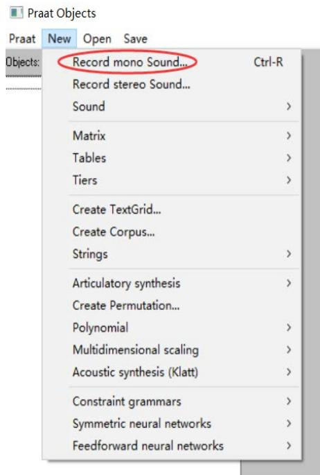

text_image

Praat Objects
Praat New Open Save
Objects:
Record mono Sound... Ctrl-R
Record stereo Sound...
Sound >
Matrix >
Tables >
Tiers >
Create TextGrid...
Create Corpus...
Strings >
Articulatory synthesis >
Create Permutation...
Polynomial >
Multidimensional scaling >
Acoustic synthesis (Klatt) >
Constraint grammars >
Symmetric neural networks >
Feedforward neural networks >

text_image

Praat Objects
Praat New Open Save Help
Objects: Read from file... Ctrl-O
Open long sound file... Ctrl-L
Read separate channels from sound file...
Read from special sound file >
Read Matrix from raw text file...
Read TableOfReal from headerless spreadsheet file...
Read Table from tab-separated file...
Read Table from comma-separated file...
Read Table from semicolon-separated file...
Read Table from whitespace-separated file...
Read Strings from raw text file...
Read from special tier file... >

声音录制完成并保存（save to list）后，或打开录音文件后，你会看到右侧的菜单，我们一般使用 view&edit 功能来查看频谱图。

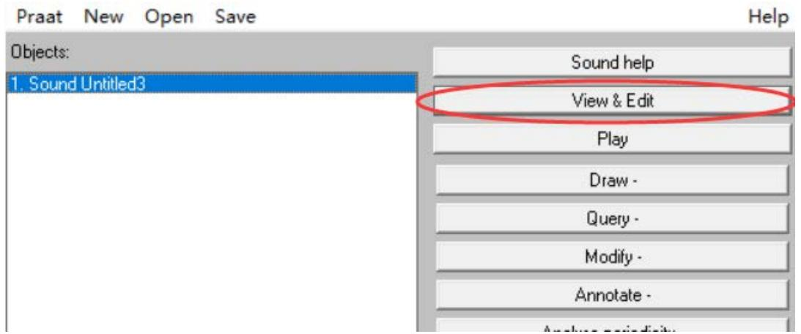

text_image

Praat New Open Save
Objects:
1. Sound Untitled3
Sound help
View & Edit
Play
Draw -
Query -
Modify -
Annotate -
Analysis periodicity

这就是打开后的频谱图，我们可以依次打开 spectrum（频谱图）、pitch（音高）、intensity（音强，等价于音量）、formant（共振峰），选择 show xx 将这些选项全部显示出来，我们可以看到下面熟悉的时频图图像，左侧是共振的频率范围，右侧是音高范围，蓝线是音高曲线，黄线是音强/音量曲线，红色的点就是软件计算出的近似共振峰位置。有了这些信息，我们就能根据掌握的共振峰特征知识来分析我们的发声方式，找出声音的问题所在，并根据相应的练习方法进一步修正。

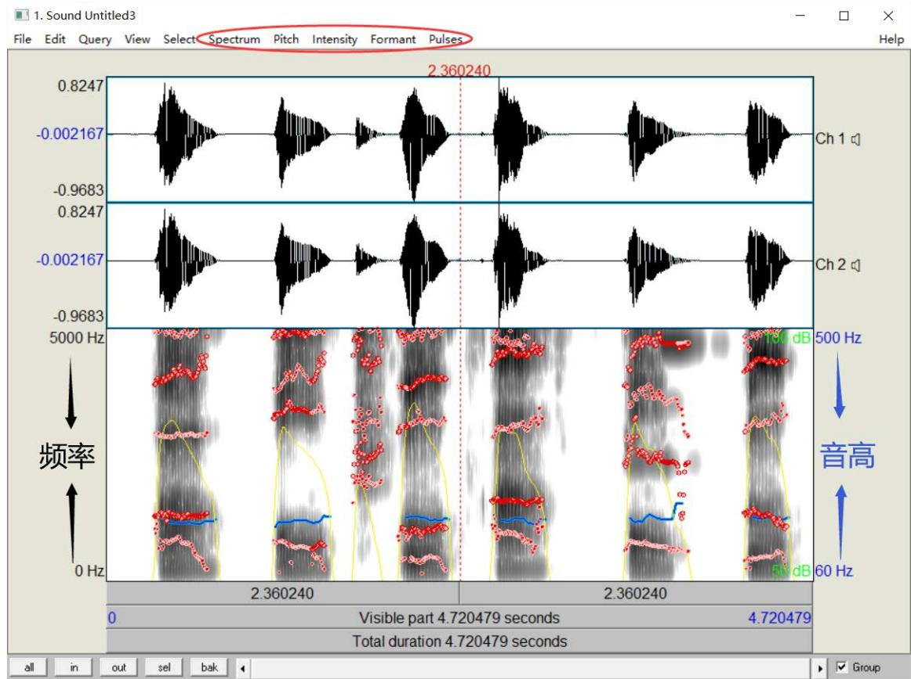

line

| Frequency (Hz) | Value     |
| -------------- | --------- |
| 2.360240       | 0.8247    |
| 2.360240       | -0.002167|
| 2.360240       | -0.9683   |
| 2.360240       | -0.9683   |
| 2.360240       | -0.9683   |
| 2.360240       | -0.9683   |
| 2.360240       | -0.9683   |
| 2.360240       | -0.8247   |
| 2.360240       | -0.8247   |
| 2.360240       | -0.8247   |
| 2.360240       | -0.8247   |
| 2.360240       | -0.8247   |
| 2.360240       | -1.91 dB  |
| 2.360240       | -1.91 dB  |
| 2.360240       | -1.91 dB  |
| 2.360240       | -1.91 dB  |
| 2.360240       | -1.91 dB  |
| 2.360240       | -1.91 dB, 60 Hz |
| 2.360240       | -1.91 dB, 60 Hz |
| 2.360240       | -1.91 dB, 60 Hz |
| 2.360240       | -1.91 dB, 60 Hz |
| 2.360240       | -1.91 dB, 60 Hz |
| 500            | 19 dB      |
| 500            | 19 dB      |
| 500            | 19 dB      |
| 500            | 19 dB      |
| 500            | 19 dB      |
| 500            | 19 dB      |
| 500            | 19 dB      |
| 500            | 19 dB      |
| 500            | -19 dB     |
| 500            | -19 dB     |
| 500            | -19 dB     |
| 500            | -19 dB     |
| 500            | -19 dB     |
| 500            | -19 dB     |
| 500            | -19 dB     |
| 500            | -19 dB     |
| 500            | 19 dB      |
| 500            | 19 dB      |
| 500            | 19 dB      |
| 500            | 19 dB      |
| 500            | 19 dB      |
| 500            | 19 dB      |
| 500            | 19 dB      |
| 500            | <19 dB     |
| 500            | <19 dB     |
| 500            | <19 dB     |
| 500            | <19 dB     |
| 500            | <19 dB     |
| 500            | <19 dB     |
| 500            | <19 dB     |
| 500            | <19 dB     |
| 500            | >19 dB     |
| 500            | >19 dB     |
| Total duration | 4.720479 |

如果你的录音设备或录音环境噪音很大，建议更换更专业的录音设备，或者使用如 goldwave等音频编辑软件录音，使用软件中的降噪功能进行处理并保存，再通过open/read from file 的打开方式导入 praat。

请注意，时频图中标示的音高曲线、音量曲线、共振峰点线等都是软件对声音信号进行分析后近似计算的结果，可能存在失准情况，如果出现严重违背常识的共振峰特征，可以尝试我们上面讲解过的观察明暗度的方式、结合每个共振峰的大致分布范围自行判断。

# 针对不同声音要素的具体练习

# 一、针对提高 F0：

通常的练习方法：

爬音阶→找到转换点（breaking point，也就是你破音的点，或者如果你能区分真声和假声的话，是指你开始使用假声的点）→稍微降低一点，将其记录为你的女性声音基频，并保持此音高→尝试像机器人一样用恒定音高说话→尝试在此基频上音调起伏地正常说话

爬音阶时使用 praat 录音，观察共振峰图，可以看到蓝线呈阶梯状上升，这就是音高上升的过程。具有女性特征的音高通常在 180Hz 以上，你找到的合适音高一般也应在这个范围。

下图给出了一个从 90Hz 到 300Hz 音阶爬升的例子：

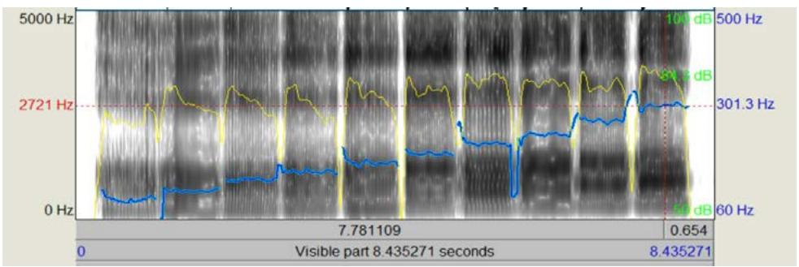

line

| Time (s) | Value (Hz) |
|----------|------------|
| 0        | 0          |
| 7.781109 | 2721       |
| 0.654    | 301.3      |
| 8.435271 | 60         |
| 500      | 100        |

记住，我们之后的大部分练习，如果没有明确说明，都要在你找到的这个更高的 F0上发声。

# 二、针对提高 F2：

正如我们前面讲过的，F2 和 F1 共同受很多发声因素影响，其中对 F2影响最大的是喉位的高低。高喉位对应高 F2，声音被感知为明亮，低喉位对应低 F2，声音被感知为暗沉。

大部分没有受过声乐训练的人并不能很好地控制喉位高低，但一般来说，当你唱歌时，唱到很低的声部时，你会出现“压低喉咙”的自然反应，此时喉位偏低，而当你唱到很高的音部时，自然的肌肉代偿效应也会帮你拉高喉部，你可以尝试唱你能唱到的最高音，持续十几秒中，你可能会感到脖子很累，这就说明肌肉在拉高喉部。但这只是自然产生的肌肉代偿效应，是你在无法主动控制喉位的情况下你的整个舌骨肌群被迫作出的反应，因而不适合用于稳定的人声语音，真正主动控制喉位的方法还需要反复练习。

控制喉位是声乐训练中常见的基本练习之一，几乎每个学习唱歌的人都接触过类似的练习，但与声音女性化要求保持高喉位不同，声乐训练往往更侧重于使用低喉位或稳定中喉位，而避免长期使用高喉位，一部分声乐训练者甚至认为高喉位发音会造成人声系统的损伤（也是网络上所谓“伪声毁嗓”这种观点的来源）。但另一些训练者指出，高喉位并不一定造成损伤，损伤是因为高喉位通常自然伴随着 narrow throat 或者说 throat tightness的现象，造成喉腔挤卡，从而损伤喉部，但经过正确的练习，可以在高喉位的同时保持喉腔开放（意味着舌骨肌群的正确使用），便能避免出现损伤。

对于声音女性化训练，这是一个重要的提示，即练习稳定高喉位的同时，必须同时做喉腔开放的练习。很多练习者出现声音嘶哑或所谓“发干”“粗糙”，就是缺乏喉腔开放的对应练习。

具体来说，我们有几个部分的分步骤练习：

# （一）高喉位的练习：

舌根部位的收缩是提高喉位的关键，而这需要你学会动用并熟练控制舌骨肌群，尤其是舌骨上肌群中的下颌骨舌肌。我们有以下几种不同的练习方法：

1、吞咽训练，用手摸住喉结，或者对着镜子观察，咽一下口水，你会发现喉结向上移动，然后再落回原位。再咽一口，这次着重体验喉结移动到顶端时喉咙内部的感觉，你会感整个喉部被完全封闭起来，有堵塞感，而当你尝试呼吸时，喉部放松，喉结就会落下。注意，这只是让你体验这些感觉，笔者不建议使用闭气吞咽的方式训练喉结抬高，这会造成喉部的损伤。  
2、前吞咽训练，想象你准备进行吞咽，但并不实际吞下，你会发现你的喉结向上移动了一点，尝试在每次呼吸间隔中都进入这种准备吞咽的状态，直到你能熟练完成这种准备吞咽的动作。一边练习，一边感受你的哪些肌肉发生了紧绷——正常状况下，你应该会感受到下巴和脖子的连接处有紧绷感。  
3、wow训练，缓慢而夸张地发出 wow或者哇噢的声音，声音可以高一些，嘴咧得越大越好，摸着喉结，或者观察镜子，你会发现在你从 wo到 ow中间咧嘴的过程中，你的喉结向上运动了一点。尝试延长 wo到 ow的过程，并让你的喉结保持在高一点的位置

下图分别是你用正常嘴型（左）和用夸张的咧嘴（中）发出 wow的时频图，可以看到咧嘴引起的喉位升高让你的 F2 有了明显的提高，而当你延长 wo 到 ow 的过程时，你会看到你的 F2 维持在了较高的水平。事实上，当你延长到足够长，你其实是在发出元音ɑː或 o 的声音，这也是我们下面要学习的元音练习的基础。

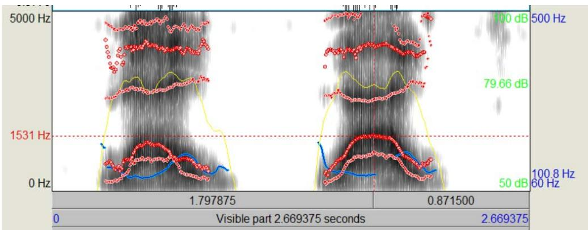

line

| Time (s) | Value (Hz) |
|----------|------------|
| 0        | 1.797875   |
| 2.669375 | 2.669375   |
| 0.871500 | 0          |
| 1.531    | 1531       |
| 500      | 50         |
| 1000     | 100        |
| 1500     | 1500       |
| 2000     | 2000       |
| 2500     | 2500       |
| 3000     | 3000       |
| 3500     | 3500       |
| 4000     | 4000       |
| 4500     | 4500       |
| 5000     | 500        |

4、EEE 音或 Errr 音训练，尽量咧开嘴，用较高的音高发出 E（衣）的声音，最好能像动画片里的女巫那样，你会观察到你的喉结在向上运动，尝试保持它的位置。Errr音练习也是同样咧开嘴，模仿一个老旧木门被推开时的声音，Errr（呃儿儿儿），你是否也能看到喉结的向上运动？同样尝试保持它的位置。

5、大狗小狗训练，尝试模仿一只大狗，发出低沉的 ho、ho、ho的喘息声，然后想象一只小狗，模仿它 ha、ha、ha 的喘息声，观察你的喉结是否向上移动了。下图是这种模仿的时频图图像，左侧是大狗声，右侧是小狗声，你也可以尝试录制并观察这种共振峰特征的变化。

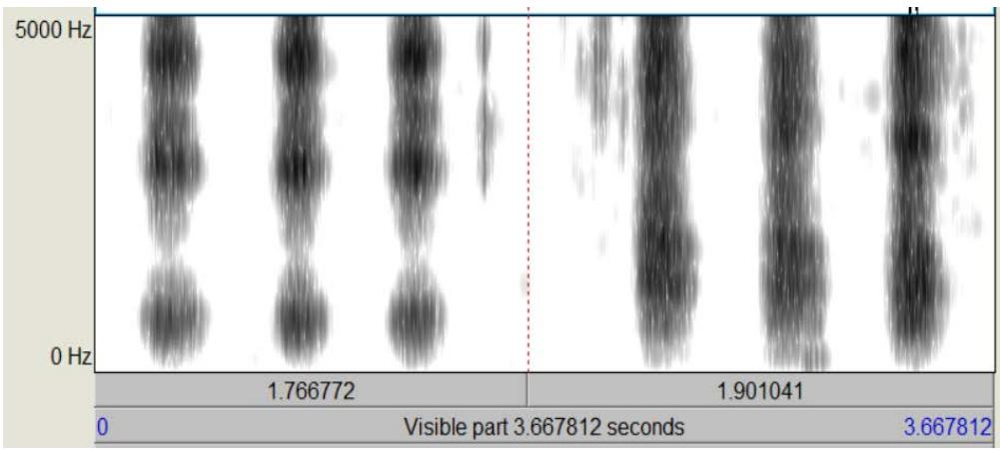

other

| Frequency | Value        |
| --------- | ------------ |
| 0 Hz      | 1.766772     |
| 5000 Hz   | 1.901041     |

6、伸舌训练，张开嘴，保持你的下巴在一个固定的位置，把你的舌头向前伸出，伸得越多越好，摸着喉结或看镜子，你会发现喉结向上移动。感受下巴和喉部连接的肌肉紧绷感，尝试控制这部分肌肉，同时你也可以尝试以这种姿势发出声音，并尝试在舌根保持不动的状态下把舌尖收回口中，多次尝试，直到你收回舌尖后仍能保持喉位在较高水平。

你可以尝试上面所有的练习方法，也可以只用一种你最能理解或者最好做到的，甚至可以用你自己在模仿和玩耍中找到的其他特殊方法（比如模仿吸血鬼的叫声之类的），记住练习的目标；找到肌肉紧绷感，尝试初步控制肌肉，稳定喉位高度

# （二）元音练习

能够稳定喉位高度后，我们需要在这种基础上发出不同的声音，首先是最基础的单元音，练习的具体方法是，打开录音软件录音，首先用你的女性音高（你在 F0训练中得到的）和正常的喉位依次读出元音（可以是国际音标的元音，也可以说是 AEIOU 五元音，或者拼音的韵母 a、o、e、i、u、ü、甚至日语的あいうえお，只要涵盖了从开口到闭口的大部分元音都可以），接着，用你上面掌握的方法抬高并稳定高喉位，然后以同样的音高依次读出同样的元音。结束录音后，导入 praat 进行分析，观察 F2共振峰是否升高，对没有升高的元音再单独进行练习。如果你不想使用 praat，也可以直接用耳朵重新听录音，感受声音变化，是否有“清晰”“明亮”的感觉，如果没有，对不足的元音再单独练习。

如果单元音练习完成，就可以再进阶练习双元音（如 ai、ao、ou、ie、iu等等）

F2是声音女性化的重要特征，所以高喉位训练是声音女性化的重中之重，本节的练习可能花费很长时间。更重要的是，因为本节的练习涉及对肌肉的控制、在生理意义上建立一种新的肌肉反射行为，所以并不能只是被动地跟随固定步骤练习，而是需要你主动地玩自己的声音（还记得笔者在前言中说过的吗？），有意识地体验、分析自己的声音。如果你只是被动地、课业式地去“学习”，那你很可能要花费更长的时间，甚至可能一无所获。

但声音特征的进一步修饰，比如下面我们要接触到的提高 F1的技巧也同样会进一步改变 F2，请注意。

# （三）喉腔开放和放松练习：

我们上面提到过，高喉位极易伴随喉腔挤卡的现象，导致喉咙损伤，所以我们需要补充一些关于喉腔开放和肌肉放松的练习。声乐训练中的喉腔开放（open throat）和放松（relaxing）本质上没有太大区别，但侧重点稍有不同，喉腔开放侧重于稳定喉位在不过高的水平上、以及保持声带不过分紧绷、加强气流，而放松侧重于围绕下颌和舌头肌肉的放松。大概的练习方式有以下几种：

1、哈欠练习，打个哈欠，感受喉位的下降，你会感到喉咙被打开，气流在增大。尝试找到打出哈欠之前准备时的感觉，在不打出哈欠的情况下让喉位下降，这样的练习有助于你的喉咙放松。  
2、放松下巴练习，抬高喉位时，下巴往往会自然收紧并向上抬起，你需要让下巴处在比自然状态下微张嘴时更低的位置（或者通俗地说，让下巴往下掉一点），这可以舒缓一系列舌骨肌肉，并使喉腔开放。尝试将这种下巴位置作为自然状态，在此基础抬高喉位说话并慢慢形成习惯。  
3、放松声带练习，声乐理论中的声带松紧（tight/loose）本质上是气流的通过率，而改善气流也是我们后面会讲到的声音女性化的修饰特征之一。这里我们可以简单了解，即对男性的基础声音来说，在语音中适当强化气流也有助于喉腔开放。后面我们会专门提到气流的练习。

需要强调的是，上述练习方式只是基础性的，练习喉腔开放和放松最重要的仍然是自己主动的体验和探索。正如我们反复提到的，抬高喉位本质上是舌骨上肌群中的下颌骨舌肌将舌骨拉高产生的效果，当下颌骨舌肌紧绷并拉高舌骨时，整个舌骨肌群和喉内肌群的其他肌肉往往也会出现紧绷，而我们最终要做的是减少其他肌肉的紧绷，这种肌肉控制并不能完全依靠死板的练习形成，而是需要练习者自己反复体验、修正，建立自己的肌肉反应。

# 三、针对提高 F1：

我们在前面讲过，F1 和 F2共同受很多因素影响，但对 F1影响最大的是张嘴的大小和舌位的高低。如果你平时注意观察，你会发现大部分男性说话时，张嘴的程度很小，或者说以自然微张的嘴型为基础变化的幅度很小，而与之相反，女性说话时嘴型变化的程度更大。另外，一部分女性说话时有被称为“咬舌音”的习惯，这意味着舌面的整体升高，通常也会带来更高的 F1。

练习提高 F1前，为了方便准确测量共振峰，建议修改 praat时频图的参数设置，将 spectrogram settings 中的 view range 调整到 0-2000Hz，同理，将 formant settings中的 formant ceiling 设定为 2000Hz，number of formants 设定为 2（即只显示 F1 和F2共振峰）

具体训练步骤：

张口训练：对于 a、o 元音，尝试用更大的嘴型发出声音，发 a 音时，下颌比平时下拉更多，发 o音时，减少噘嘴的程度，更多地张开嘴，用嘴唇向内包裹的方式形成圆唇状发音。使用 praat 记录并观察 F1的位置。

例子：用更小的嘴型（左）和更大的嘴型（右）发 a 音的时频图

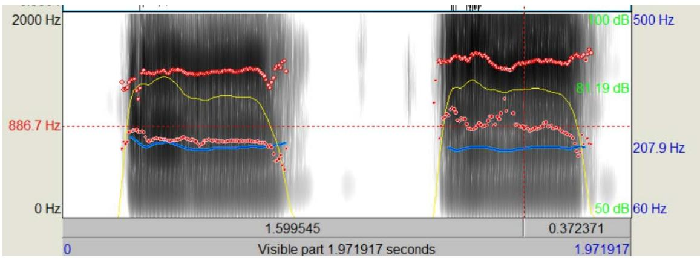

line

| Time (s) | Frequency (Hz) |
| -------- | -------------- |
| 0        | 886.7          |
| 1.599545 | 207.9          |
| 0.372371 | 50             |

例子：用小而噘嘴的嘴型（左）和大的、嘴唇包裹的嘴型（右）发 o音的时频图

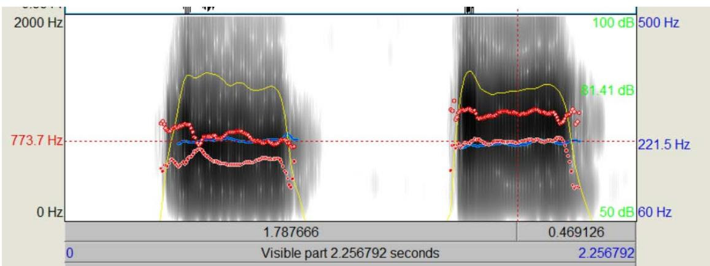

line

| Time (s) | Frequency (Hz) |
| -------- | -------------- |
| 0        | 773.7          |
| 1.787666 | 100            |
| 0.469126 | 81.41          |
| 0.469126 | 50             |
| 0.469126 | 60             |

咧嘴训练：对于元音 e，尝试将嘴张大的同时咧开一些。使用 praat 记录并观察 F1的位置。

例子：用小的嘴型（左）和大的、咧开的嘴型（右）发 e音的时频图  
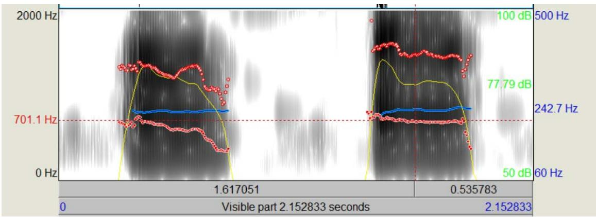

line

| Time (s) | Frequency (Hz) |
| -------- | -------------- |
| 0        | 701.1          |
| 1.617051 | 242.7          |
| 0.535783 | 50             |
| 2.152833 | 100            |

双元音训练：对 ia、ie、ao、ou等双元音，在发出或过渡至 a、o、e 时采用与上面相同的方式发音。

舌位训练：舌位的高低前后不仅影响 F1，也会在一定程度上影响 F2，但与嘴巴张开不同的是，舌位虽然影响 F1、F2，进而影响声音的性别感知，但对于所有女性来说，并没有相对统一的、明显区别于男性说话者的舌位特点。诚然，一些“咬舌音”或抬高舌面的说话方式会听起来更“嗲”或“可爱”，但这并不是声音女性化必须的方式。所以总的来说，舌位训练并没有固定的模式，练习者可以采用元音练习的方式，对同一元音尝试多种不同的舌位，自行分析和感受其发音，选择最适合自己、或最喜欢的一种舌位加以练习即可。

# 四、针对其他修饰性因素

# （一）改善气流

正如我们在声音的性别感知部分中提到过的，谐波噪声比 HNR 代表的呼吸声音，也就是声音中气流的因素，也能对声音女性化起到很好的修饰作用。但要注意，改善声音中的气流不等于使用吹气音（或者说耳语）说话，也不完全等同于声乐训练中的“气声唱法”。还记得我们在打开喉咙训练中提到的声带松紧（tight/loose）吗？改善气流的本质就是一定程度地放松声带。女性的说话声音相对于男性而言，声带更放松，气流的通过率更高。我们可以通过以下练习步骤改善气流特征：

1、将手掌放在嘴巴前面，张开嘴，做哈气的动作，你会感到手掌上有温热的气流  
2、保持嘴型和哈气的状态，使声带振动，在未受训练的情况下，通常你会感到手掌上气流明显减弱  
3、尝试在保持声带振动的同时使气流增加，确保你在稳定地发出有振动的声音的同时，手掌重新感受到气流，保持数秒钟，重复以上练习。

当你能熟练做到发声的同时有气流后，再进行元音训练，用这种有气流的声音依次发出元音，直到每个元音都可以感受到气流。但注意，不同元音的气流程度差异是正常的，通常来说，开口程度越大的元音可用的气流也更多，而如 o、u等开口程度小的元音，气流小甚至没有气流都是正常的。如果过分追求气流充足，可能会导致声音变为吹气音，失去原本的振动声音，这样的声音通常是无法作为说话声音使用的。

改善气流的元音训练也可以使用 praat 进行分析，praat 可以近似计算谐波噪声比HNR，方法是对列表中的一个声音样本选择 analyse periodicity→to harmonicity(cc)，声称一个 harmonicity 声音样本，再对该样本选择 query→get mean 操作，就得到了声音样本的谐波噪声比 HNR。但由于大部分人并没有专业的录音设备和良好的录音环境，背景噪音会严重影响计算的准确性，所以不推荐使用这种方法进行分析。相比测量 HNR 数值，更简单的方法是观察时频图，气流明显的声音相比于气流不明显的声音，在原先没有共振的频率上会出现一定程度的音高增强（或者直观地说，原先颜色发白的各个位置会变深），如下图所示，左边是减少气流的元音 a 的发音，右边是增强气流的元音 a 的发音，可以看到这种变化的存在。

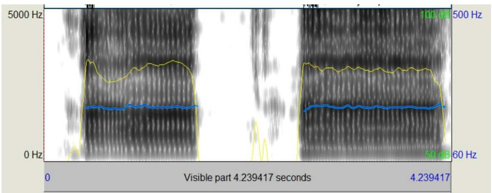

line

| Time (s) | Value |
|----------|-------|
| 0        | 0     |
| 5000     | 5000  |
| 100      | 100   |
| 60       | 60    |
| Visible part 4.239417 seconds | 4.239417 |

# （二）增加声调起伏

声调起伏是指词语和语句长度上音高的高低变化，男性通常的发声习惯是平缓的，音高的变化较小，而女性的发声习惯中音高变化更大，如果你注意观察，在生活中很容易发现这种特征。练习声调起伏的训练需要建立在元音和单字训练的基础上。

朗诵是一种很好的声调起伏练习，你可以在朗诵的过程中体会声调的起伏感，然后慢慢在口语中加入这种特征。但要注意，虽然大部分女性的声调起伏比男性更多，但并没有达到朗诵时常见的起伏程度。在口语中加入这种特征时，需要你注意观察真实的女性口语习惯，适度地增加起伏感。

# （三）其他改善声音的因素

在改善气流和增加声调起伏之外，声音女性化的修饰性特征还包括减少声音抖动、使用更少的声带厚度等方面，但这些进阶的特征往往需要更专业和持久的声乐训练，而且这些特征对声音性别感知的贡献是微乎其微的——声音抖动过量、声带偏厚的顺性别女性也随处可见，对于 MTF以“被感知为女性”为目标的声音女性化来说没有那么必须。我们就不进一步展开介绍了。

除此之外，由于声音女性化需要长期使用高喉位，要更加注重喉部的健康，减少过度的声音使用。针对这种需求，声乐训练中的 Twang 技巧（国内一般译为咽音）可以起到很好的帮助。Twang 技巧能够使声带振动时上方的会厌组织保持在半张开的状态，使咽部形成喇叭状的空间，允许发声者使用更少的能量发出更明亮的声音，减少声音的过度使用。Twang 技巧的练习方式很好找到，感兴趣的读者可以自行查找相关教学视频进行练习。

# 参考文献注释：

[1] The Relative Contributions of Speaking Fundamental Frequency and Formant Frequencies to Gender Identification Based on Isolated Vowels，VOLUME 19, ISSUE 4, P544-554, DECEMBER 01, 2005   
[2] Kim HT. Vocal Feminization for Transgender Women: Current Strategies and Patient Perspectives. Int J Gen Med. 2020   
[3]Suire, A., Tognetti, A., Durand, V. et al. Speech Acoustic Features: A Comparison of Gay Men, Heterosexual Men, and Heterosexual Women. Arch Sex Behav 49, 2575– 2583 (2020).   
[4]Van Borsel J, Janssens J, De Bodt M. Breathiness as a feminine voice characteristic: a perceptual approach. J Voice. 2009